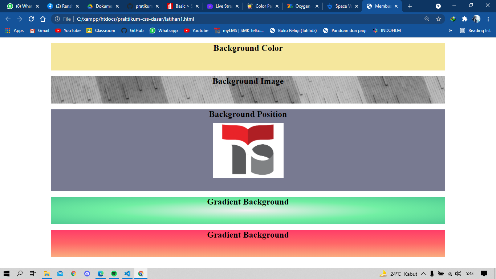
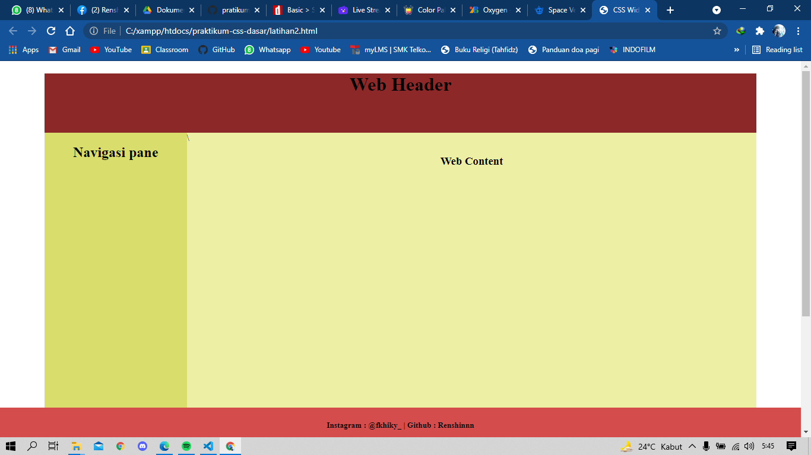
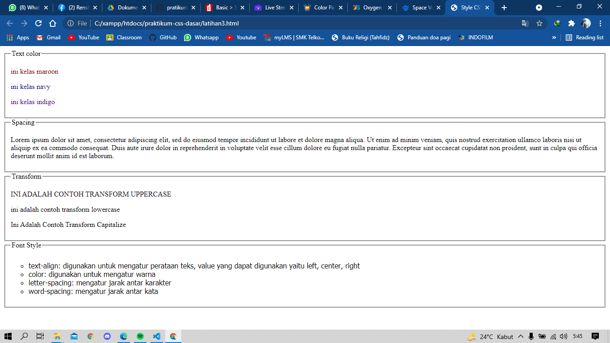
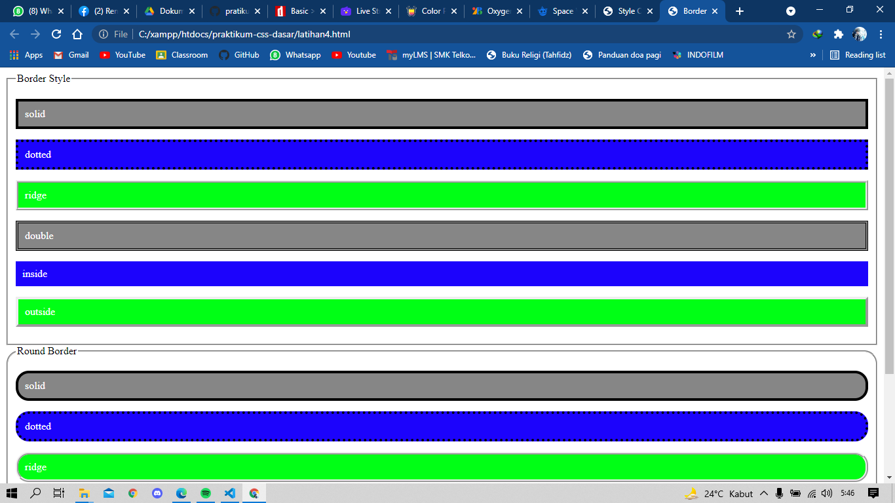
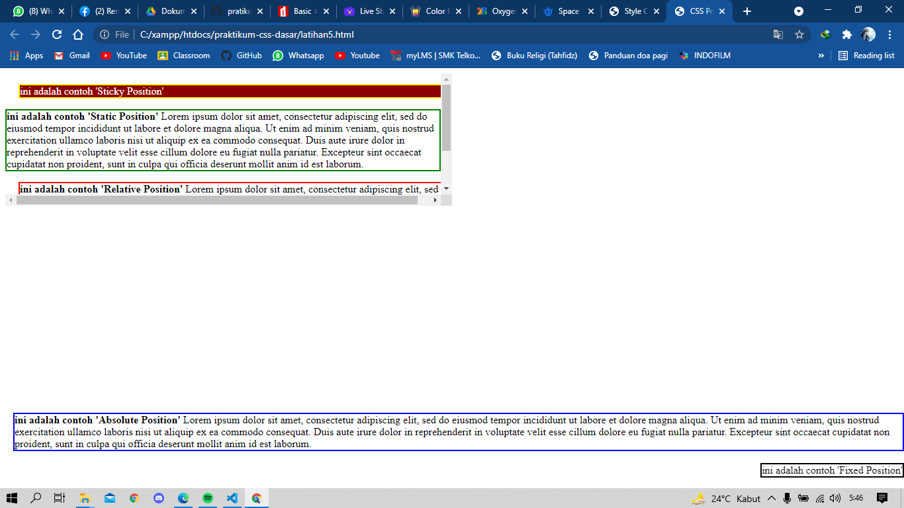
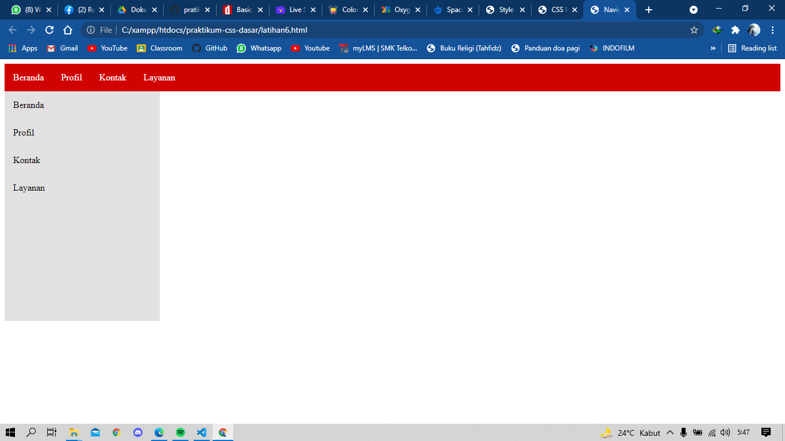
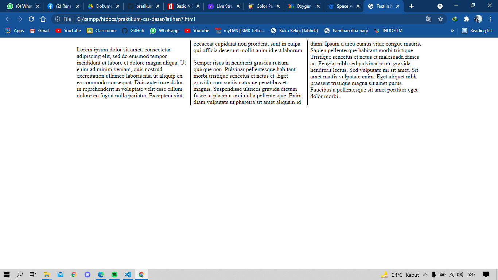
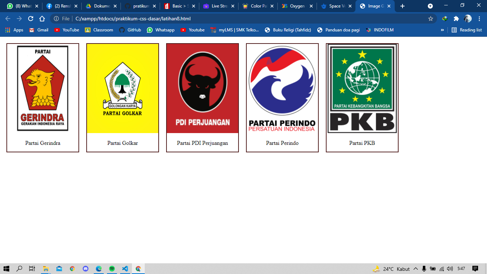
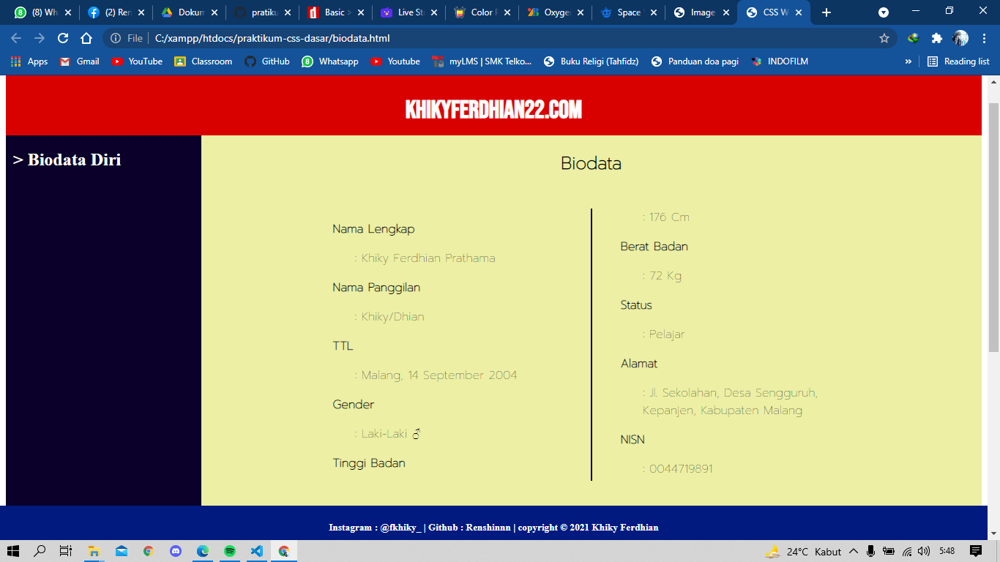
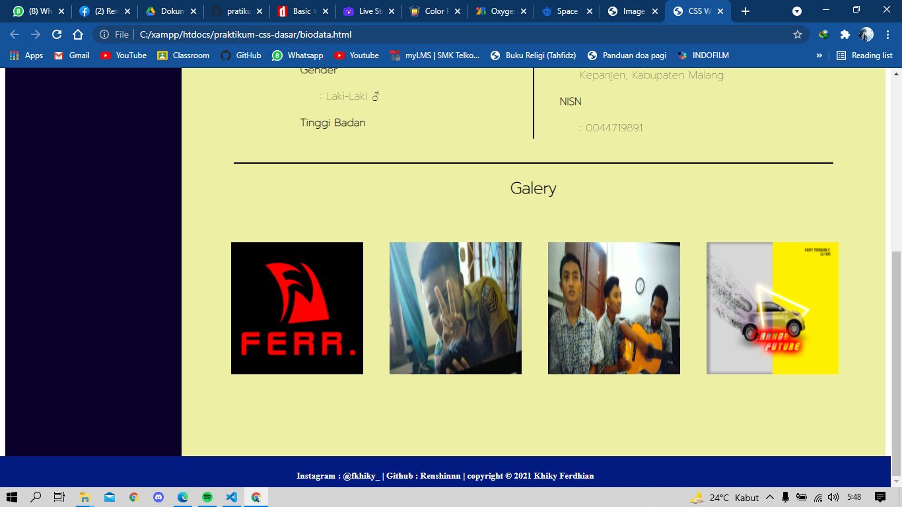

# <b>Praktikum CSS Dasar</b>

CSS (Cascading Style Sheet) merupakan sekumpulan kode yang digunakan 
untuk mempercantik atau styling halaman web yang termuat pada komonen atau tag 
yang membentuk sebuah web. Struktur penulisan sintak CSS adalah sebagai 
berikut. 
 
<b>Selector {
    property: value;
}</b>
 

Keterangan :  
<dl>
<dd>- Selector: merupakan nama komponen / objek yang akan diberikan style. Selector
ini dapat berupa nama tag pada HTML, id tag HTML, atau nama class pada 
sebuah tag HTML.  
<ul><ol type="1">
<li>Untuk penulisan selector dengan tag, dapat dituliskan dengan nama tag 
HTML secara langsung, contoh p, img, h1, dan lain-lain.
<li>Untuk penulisan selector dengan nama class, dapat dituliskan dengan diawali 
tanda titik (.) diikuti dengan nama classnya
<li>Untuk penulisan selector dengan nama id, dapat dituliskan dengan diawali 
tanda pagar (#) diikuti dengan nama id-nya.</dd> 
<dd>- Property: merupakan bagian dari selector yang akan kita ubah.</dd>
<dd>- Value: merupakan nilai dari property.</dd></dl> 
<a href="https://github.com/Renshinnn/pratikum-css-dasar/blob/master/latihan1.html"><h2><b>CSS Background</b></h2></a> 

CSS Background digunakan untuk mennentukan background dari sebuah elemen. 
Terdapat beberapa macam property pada CSS background yaitu sebagai berikut.
<ul>
<li>background-color → menentukan background dengan warna
<li>background-color → menentukan background dengan warna
<li>background-attachment → menentukan background agar posisinya fix pada 
halaman web
<li>background-position → menentukan posisi background.
<li>background-position → menentukan posisi background.
</ul>
 

<a href="https://github.com/Renshinnn/pratikum-css-dasar/blob/master/latihan2.html"><h2><b>CSS Width, Height, Margin, dan Padding
</b></h2></a> 

Dalam menentukan ukuran pada sebuah elemen, dapat dengan menggunakan 
<b>width</b> (untuk menentukan panjang elemen) dan <b>height</b> (untuk menentukan lebar 
atau tinggi element). Untuk menetukan jarak antara satu elemen dengan elemen 
yang lain dapat menggunakan <b>margin</b>, sedangakan untuk mengatur jarak antara 
border elemen dengan konten di dalamnya menggunakan <b>padding</b>
 
<a href="https://github.com/Renshinnn/pratikum-css-dasar/blob/master/latihan3.html"><h2><b>CSS Text</b></h2></a> 

CSS dapat mengatur style dari teks yang ada pada halaman web yang dibuat. 
Terdapat beberapa property yang dapat digunakan untuk mengatur style teks yaitu 
sebagai berikut.
<ul>
<li>text-align → digunakan untuk mengatur perataan teks, value yang dapat 
digunakan yaitu left, center, right.
<li>color → digunakan untuk memberikan warna pada teks.
<li>letter-spacing → mengatur jarak antar karakter.
<li>word-spacing → mengatur jarak antar kata.
<li>line-height → mengatur jarak antara baris satu dengan baris lainnya.
<li>font-size → mengatur ukuran font.
<li>font-size → mengatur ukuran font.
<li>font-style → mengatur style pada teks dengan value (normal, italic)
<li>font-weight → mengatur ketebalan font.</ul>

 
<a href="https://github.com/Renshinnn/pratikum-css-dasar/blob/master/latihan4.html"><h2><b>CSS Border</b></h2></a> 

Beberapa elemen pada HTML mempunyai border atau garis tepi dari suatu 
komponen. CSS dapat mengatur style untuk tampilan border dengan 
menggunakan property berikut ini.
<ul>
<li>border-style → mengatur jenis garis pada border.
<li>border-width → mengatur tebal border.
<li>border-color → mengatur warna dari border.
<li>border-radius → mengatur sudu dari border.
</ul>

 
<a href="https://github.com/Renshinnn/pratikum-css-dasar/blob/master/latihan5.html"><h2><b>CSS Position dan Overflow</b></h2></a> 

Setiap elemen pada halaman web mempunyai posisi atau tata letak. Pada CSS 
terdapat beberapa kode untuk menentukan posisi dari setiap elemen yaitu sebagai 
berikut.
<li>Static
<li>Absolute
<li>Relative
<li>Fixed
<li>Sticky

Pada setiap elemen mempunyai ukuran panjang dan lebar yang telah ditentukan. 
Apabila konten di dalam elemen melebihi ukuran dari panjang atau lebar elemen, 
maka trik untuk mengatasi konten yang overlapping dengan menggunakan property 
<b>overflow</b>. Overflow digunakan untuk memunculkan scroll bar jika konten pada 
sebuah elemen melebihi ukuran elemen tersebut. Berikut ini contoh penggunaan 
CSS position dan overflow.

 
<a href="https://github.com/Renshinnn/pratikum-css-dasar/blob/master/latihan6.html"><h2><b>Navigation Bar</b></h2></a> 

Pada halaman sebuah website, sering kita jumpai menu bar atau navigasi bar yang 
berisi link-link menu yang terdapat pada halaman web tersebut. Menu bar bias kita 
Modul CSS Tim Guru RPL | SMK Telkom Malang
lihat pada bagian atas web, sedangkan navigasi bar sering kita jumpai pada bagian 
tepi halaman web. Berikut ini contoh kode CSS dan HTML untuk membuat sebuah 
menu bar dan navigasi bar.

 
<a href="https://github.com/Renshinnn/pratikum-css-dasar/blob/master/latihan7.html"><h2><b>Text in Multiple Column</b></h2></a> 

Sering kita jumpai halaman web yang berisi konten berita yang disajikan dalam 
beberapa kolom seperti layout pada koran. Dengan CSS kita dapat membuat 
tampilan tersebut dengan menerapkan beberapa property yaitu sebagai berikut.
<ul>
<li>Column-count → menentukan jumlah kolom pada teks
<li>Column-gap → menentukan jarak antar kolom
<li>Column-rule-style → menentukan tipe garis yang menjadi pemisah antar kolom
<li>Column-rule-width → menentukan tebal garis pemisah antar kolom
<li>Column-rule-color → menentukan warna garis pemisah antar kolom </ul>

 
<a href="https://github.com/Renshinnn/pratikum-css-dasar/blob/master/latihan8.html"><h2><b>Image Gallery</b></h2></a> 

Pada halaman website banyak terdapat galeri foto yang ditampilkan untuk 
menunjukkan struktur organisasi atau profil pengembang web tersebut.

 
<a href="https://github.com/Renshinnn/pratikum-css-dasar/blob/master/biodata.html"><h2><b>Tugas Praktikum (Biodata)</b></h2></a> 
 
